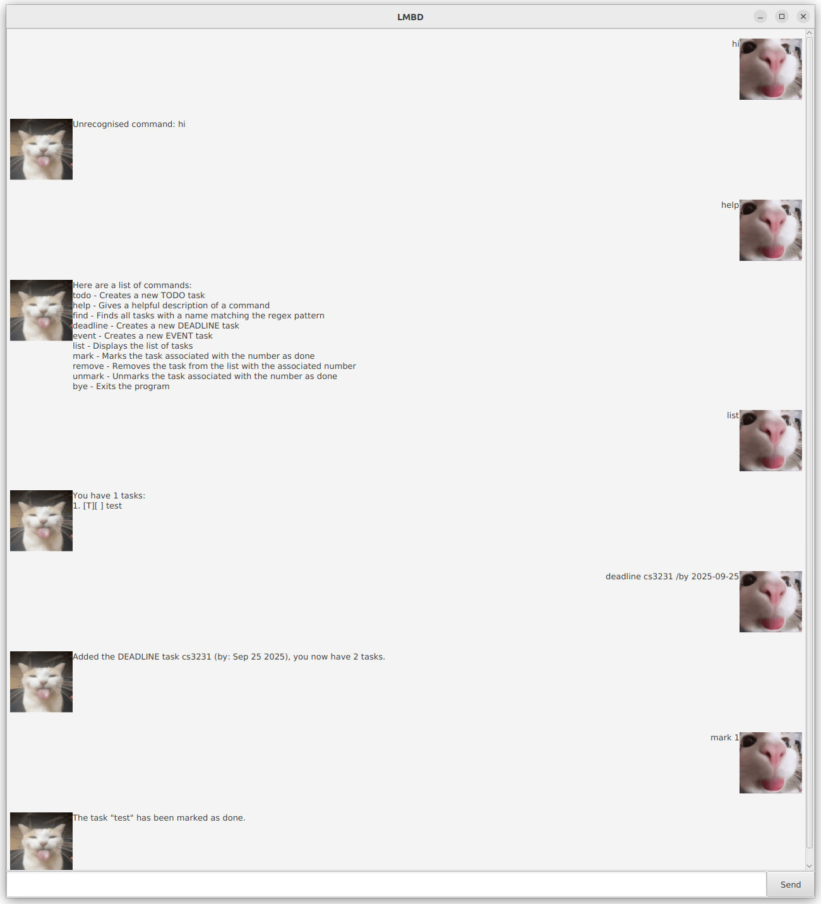

# 🚀 LMBD: Blazingly Fast ChatBot written in Java 🚀



Lmbd is a JavaFX app that helps you manage a variety of tasks. Communication with
the chatbot is through commands, to optimize the user experience for those used
to CLIs.

## Quick Start

1. Ensure you have Java 17 or above installed on your computer.
2. Download the latest jar in the [releases page](https://github.com/mug1wara26/ip/releases)
3. Move the jar to a folder of your choice
4. Double click on the jar file or run `java -jar lmbd.jar` in the terminal.
5. Send the `help` command to see the list of commands!

## Using Lmbd in your own application

```java
import ui.Lmbd;
import command.Command;

public class Main {
  public static void main(String[] args) {
    ...
    // Default save file is lmbd.save
    Lmbd lmbd = new Lmbd(); // Uses all commands available

    // Or you can specify commands
    Lmbd lmbd2 = new Lmbd(new Command[] {new ByeCommand(), new HelpCommand()});

    // Or you can specify the save file
    Lmbd lmbd3 = new Lmbd("data/lmbd.save", new Command[] {new ByeCommand(), new HelpCommand()});
  }
}
```

## Features

### Bye

```
bye
```

Exits the chatbot

### Deadline

```
deadline <name of task> /by YYYY-MM-DD
```

Creates a new deadline task using the name and date provided

### Event

```
event <name of task> /from YYYY-MM-DD /to YYYY-MM-DD
```

Creates a new event task using the name, and the from and to dates provided

### Find

```
find <pattern>
```

Searches for tasks with a name matching the pattern using [Pattern.matches](https://docs.oracle.com/javase/8/docs/api/java/util/regex/Pattern.html#matches-java.lang.String-java.lang.CharSequence-)

### Help

```
help
```

Returns a list of commands and a short description for each

### List

```
list
```

Lists all tasks

### Mark

```
mark <task_number>
```

Marks a task as done with the corresponding number from `list`

### Remove

```
remove <task_number>
```

Removes a task with the corresponding number from `list`

### Todo

```
todo <name of task>
```

Creates a new todo task using the name provided.

### Unmark

```
unmark <task_number>
```

Marks a task as undone with the corresponding number from `list`
